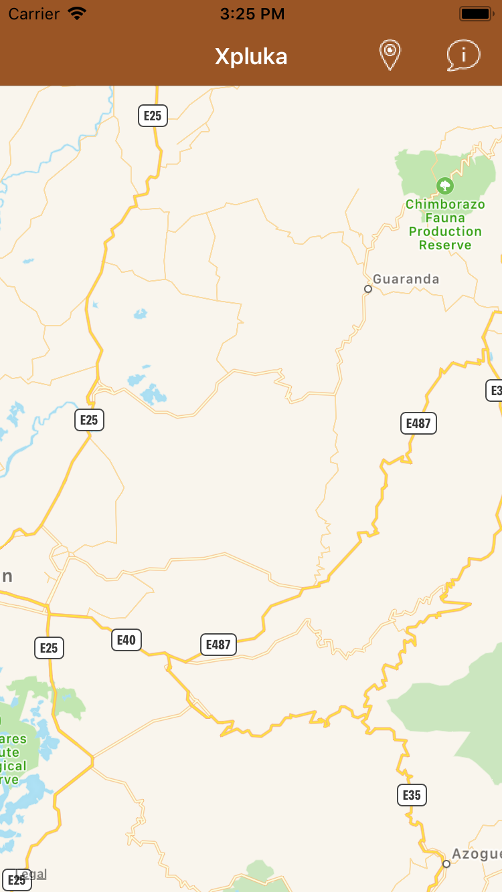
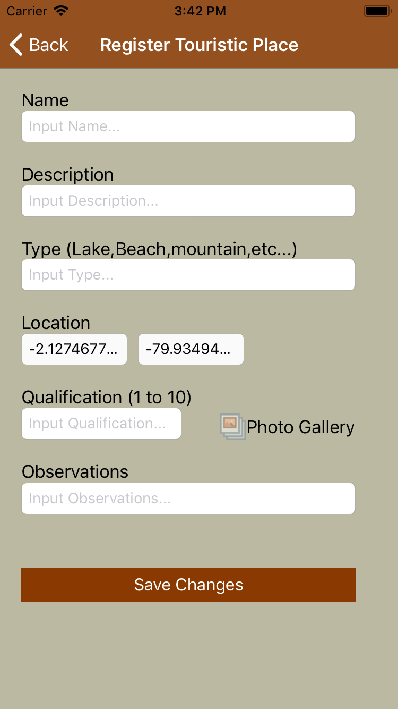
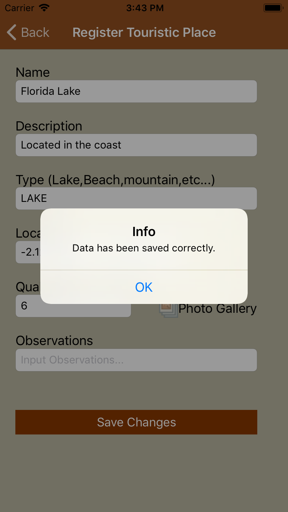
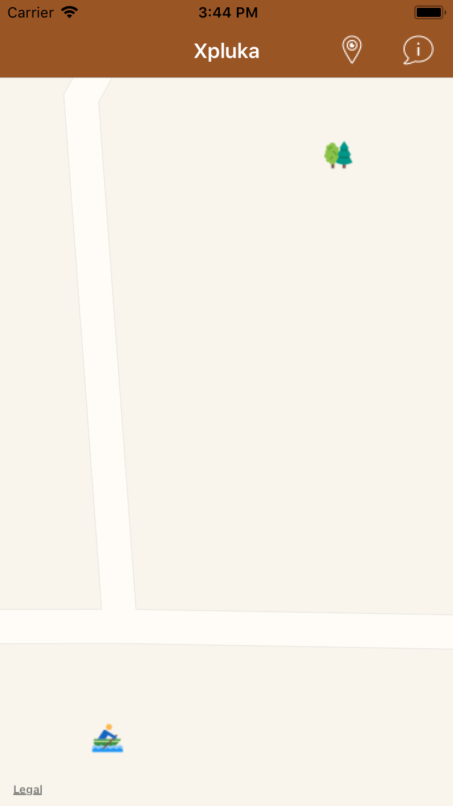
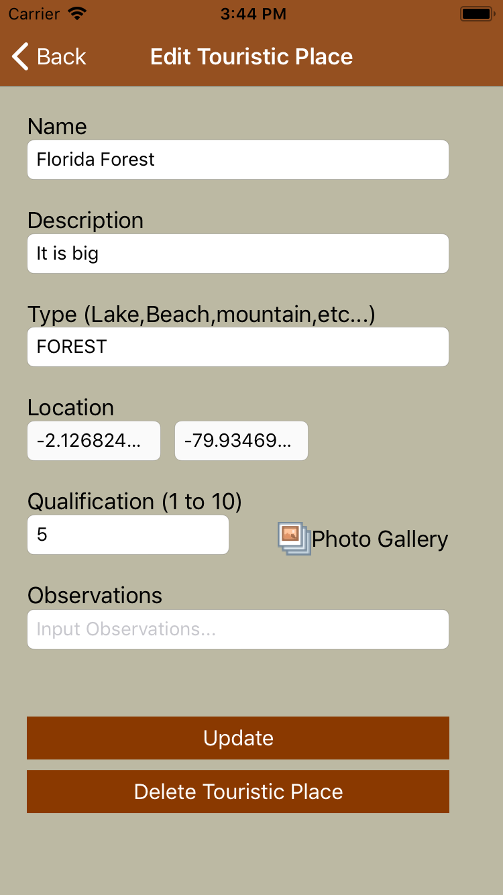
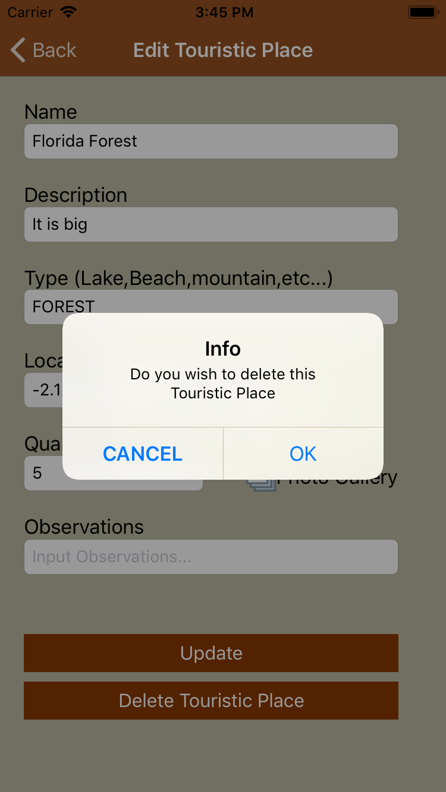
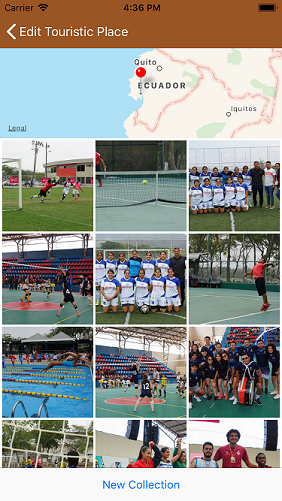

# xPluka
This app allows to the user to create Touristic places with its information and photos downloaded using the Flickr API. 
Allows to register visits referenced to the created places.
These places can be seen in the map.
## Getting Started
No Notes
### Prerequisites
To execute this app it is necesary to open it with Xcode 9 or superior and have and active account in Flickr.
### Installing
You need to follow the next steps: 
1.- Open the project using Xcode. 
2.- Go to the Helpers Directory and open the **Client+Extension.swift** file and go to the  **FlickrParameterValues** struct and set in the APIKey the value gotten in your Flickr Account. 
3.- Clean, Build and run the project, choosing an simulator or real device. 

**Executed Example**

**Main Screen** 
It shows the map where will be shown the Touristic Places.

**Map instructions** 
It shows a message where you can see the features of the view.

**Register Touristic Place** 
This view allows to create a new place with the required fields: 
* Name 
* Description 
* Type (you can selec from the list) 
* Location (fixed when the view is shown) 
* Qualification (validated from 1 to 10) 
* Observations (Commentary of the Touristic Place) 

**Save Touristic Place**  
After filling all the required fields then the user can press the button save changes, it shows a message where the place is created

**Touristic Place shown in the map** 
After the creation of the Touristic place it shows the tp in the map. 

**Edit Touristic Place** 
By pressing in the created place, it shows the register TP view with the last filled information, also allows to see the image gallery by pressing in the image gallery button. 

**Delete Touristic Place** 
You can delete the touristic place by pressing the delete button, after that it shows a message to confirm the deletion.

**Show image gallery** 
By pressing the gallery button it shows the loaded photos that belongs to the touristic place, by pressing the new collection button it starts downloading new photos using the Flickr API.

## Built With

* [XCode](https://developer.apple.com/xcode/) - The mobile framework used

## Versioning
Last version available 1.0

## Authors

* **Jonathan Lucero** - *Udacity Capstone Project* 

## License
This project is licensed under the MIT License - see the [LICENSE.md](LICENSE.md) file for details
